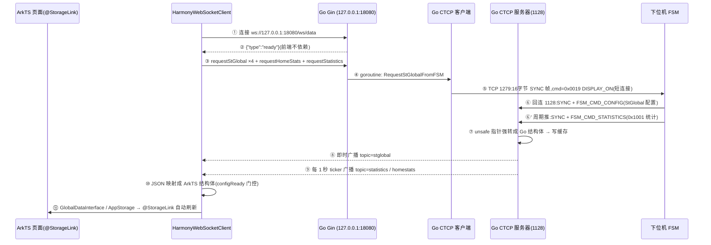

# 一条数据的旅程:从 DISPLAY_ON 到主页仪表盘

> **ArkTS 前端 + Go 后端 · 实时数据上行链路培训**
>
> 配套文档:《ArkTs+Go.md》(goTest 根目录)—— 主培训稿,案例是"等级配置保存闭环",讲的是**控制下发 + 回读**。
> 本文档讲**实时数据上行**:握手 → 下位机推数据 → Go 接收解析 → 推给前端 → UI 显示。
> 两条链共用同一套 WebSocket 帧 / SYNC 帧 / JSON 映射机制,听懂一条,另一条自然就通了。

---

## 0. 开场:先破除三个常见"记忆偏差"

| 常见说法 | 真相 | 代码证据 |
|---|---|---|
| "前端连上后发一个 SYNC" | 前端发的是 JSON 文本 `{"type":"requestStGlobal","fsmId":256}`。**SYNC 是 Go 发给下位机的 16 字节 TCP 帧头**,和前端没关系 | `HarmonyWebSocketClient.ets:793` / `ctcp_client.go:210` |
| "后端连接成功后会先回一帧……" | 回的是 `{"type":"ready"}`。但注意:**前端并不等这一帧**,open 回调触发就直接发请求了 | `websocket.go:271` / `HarmonyWebSocketClient.ets:683` |
| "后端把数据 mmap 给前端" | **没有 mmap,没有共享内存**。是 WebSocket JSON 广播 + 前端把 JSON **映射(map)成 ArkTS 结构体** | `StStatisticsJsonMapper.ets:9` |

> 培训话术:这三个点是我自己都记岔过的,先纠正,后面链路就不会跑偏。

---

## 1. 全景时序图



纯文本版(PPT 里贴图不方便时用):

```
前端连 ws://127.0.0.1:18080/ws/data ──> Go 推 "ready"
前端 open 回调 ──> requestStGlobal×4 + requestHomeStats + requestStatistics
Go 收到 ──> goroutine ──> 连 FSM:1279 ──> 发 16 字节 SYNC 帧(DISPLAY_ON 0x0019) ──> 关连接
FSM 收到 ──> 回连 HC:1128 ──> 推 FSM_CMD_CONFIG(配置) + 周期推 FSM_CMD_STATISTICS(统计)
Go 1128 收包 ──> 读"SYNC"→读头→读 payload ──> unsafe 强转成 Go 结构体 ──> 写缓存
每秒 ticker ──> 最新快照转 JSON ──> 广播 statistics/homestats;配置帧收到即广播 stglobal
前端 onmessage ──> JSON.parse ──> 按 topic 分发 ──> 映射成 ArkTS 结构体
GlobalDataInterface/UIDataSync ──> AppStorage ──> @StorageLink 自动重渲染 ──> UI 显示
```

---

## 2. 第 0 步:后端宿主启动(E:\goTest)

gotest 的 `EntryAbility` 通过 NAPI(`libentry.so`)调用 Go 动态库 `libohos.so` 的 C ABI 导出:

| 调用 | Go 导出 | 干什么 | 代码 |
|---|---|---|---|
| `testNapi.startServer()` | `GoStartServer` | Gin 监听 **127.0.0.1:18080**,注册 `/ping`、数据库 HTTP 路由、`/ws/data` | `main.go:31` → `server.go:51` |
| `testNapi.startTcpServer()` | `GoStartTCPServer` | 监听 **1127(图像)/1128(统计)** 两个 CTCP 端口,并启动**每秒统计推送 ticker** | `main.go:80` → `ctcp_server.go:122`、`:166` |
| (更早) | `GoInitORMWithPath` | 初始化 SQLite ORM | `main.go:69` |

要点:
- HTTP 和 WebSocket **共用 18080 一个端口**,只监听回环地址,外面连不进来。
- `StartStStatisticsSpeedPublisher()`(`ctcp_statistics.go:32`)在 TCP 服务器启动时就拉起,每 1 秒推一次统计——**不管有没有下位机数据,ticker 一直在跑**。

---

## 3. 第 1 步:前端连接 WebSocket

前端入口只有两行(`my_harmony/entry/src/main/ets/entryability/EntryAbility.ets:16`):

```typescript
getHarmonyWebSocketClient().start();  // 连 WebSocket
getUIDataSync().start();              // 订阅状态层 → 同步到 AppStorage
```

- 地址:`DEFAULT_WS_URL = 'ws://127.0.0.1:18080/ws/data'`(`HarmonyWebSocketClient.ets:40`)
- Go 侧 `handleWebSocket`(`websocket.go:253`):升级连接 → 注册进 hub → 起 `writePump` 协程 → 立刻推 `{"type":"ready"}`
- 断线处理:前端 close 回调 **3 秒后自动重连**(`HarmonyWebSocketClient.ets:713`);重连成功重新走 open 回调,重新请求全部数据 → **断网不丢状态**
- 心跳:前端发 `"ping"`,Go 回 `{"type":"pong"}`(`websocket.go:394`);Go 侧 70 秒收不到 pong 就断开

---

## 4. 第 2 步:前端发请求(不是 SYNC!)

open 回调(`HarmonyWebSocketClient.ets:683-697`)一次发齐:

```typescript
for (let subsysIndex = 0; subsysIndex < ConstPreDefine.MAX_SUBSYS_NUM; subsysIndex++) {
  void this.requestStGlobal(ConstPreDefine.getFsmId(subsysIndex));  // ×4 个子系统
}
void this.requestHomeStats();    // 主页统计快照
void this.requestStatistics();   // 统计快照
```

线上飞的是三种纯 JSON 文本:

```json
{"type":"requestStGlobal","fsmId":256}
{"type":"requestHomeStats"}
{"type":"requestStatistics"}
```

Go 侧 `handleIncoming`(`websocket.go:392`)按 `type` 字段 switch 分发——这个 switch 就是**后端的"命令路由表"**,前端能发的所有命令都在这里(等级保存、果杯测试、电机使能……全在同一个 switch 里)。

---

## 5. 第 3 步:Go 给下位机发 DISPLAY_ON(SYNC 帧在这里)

调用链:

```
handleIncoming case "requestStGlobal"         websocket.go:411
  → handleRequestStGlobal                     websocket_handlers.go:11(goroutine,不阻塞 WS 读循环)
    → RequestStGlobalFromFSM(destID)          ctcp_client.go:465
      → StartCTCPClient("",0,dest,0x0019,nil)  ctcp_client.go:452
        → SyncRequest                         ctcp_client.go:156
```

`SyncRequest` 做的事:

1. `resolveCTCPTarget`:由 destId 算出 FSM IP(`192.168.0.x`)、端口 **1279**(`ctcp_client.go:346`)
2. **DISPLAY_ON/OFF 免"子系统已在线"检查**(`ctcp_client.go:161`)——它就是用来建立在线状态的引导命令,不能自己卡自己
3. 500ms 超时拨号 → 发 16 字节帧头 → 有 payload 再发 payload → **短连接,发完即关**

16 字节 SYNC 帧头(小端序,结构体在 `ctcp_client.go:91`,序列化在 `:337`):

```
偏移    0          4          8          12
      ┌──────────┬──────────┬──────────┬──────────┐
      │  "SYNC"  │  srcId   │  destId  │  cmdId   │
      │0x434e5953│  0x1000  │  0x0100  │  0x0019  │
      └──────────┴──────────┴──────────┴──────────┘
        魔数       上位机HC    1号FSM    DISPLAY_ON
```

> 培训金句:**前端到 Go 说 JSON,Go 到下位机说 SYNC 二进制——Go 是"翻译官"。**

fsmId 容错:前端传了非法 fsmId,Go 兜底回默认 1 号 FSM `0x0100`(`websocket_handlers.go:22`)。

---

## 6. 第 4 步:下位机推数据,Go 怎么接收

FSM 收到 DISPLAY_ON 后**反向连接 HC 的 1128 端口**,以短连接推送:
- 先推 `FSM_CMD_CONFIG`(0x1000,StGlobal 配置回读)
- 之后周期推 `FSM_CMD_STATISTICS`(0x1001,统计)

Go 侧每个连接一个 goroutine(`ctcp_server.go:276` acceptLoop → `:300` handleConnection),**三段读**:

| 段 | 读多少 | 干什么 | 代码 |
|---|---|---|---|
| ① recvCTCPSync | 4 字节 | 必须等于 ASCII `"SYNC"`,否则拒绝 | `ctcp_protocol.go:12` |
| ② recvCTCPCommand | 12 字节 | 小端解出 srcId / dstId / cmdId;校验 `dstId == 0x1000`(是发给我的吗) | `ctcp_protocol.go:23`、`ctcp_server.go:316` |
| ③ recvCTCPPayload | 按 cmdId 定 | 有的命令带 4 字节长度前缀,有的按结构体大小定长读 | `ctcp_protocol.go:40` |

读完交给 `handleCommandPayload`(`ctcp_server.go:352`)按 cmdId switch——这是**下行方向的"命令路由表"**,和第 4 节的 WebSocket switch 一进一出,正好对称。

---

## 7. 第 5 步:Go 怎么解析(二进制 → 结构体)

核心只有一行(`ctcp_server.go:575`):

```go
func ParseData[T any](payload []byte) (T, error) {
    // ...长度校验...
    return *(*T)(unsafe.Pointer(&payload[0])), nil
}
```

把字节流**按内存布局直接强转**成 Go 结构体,等价于 C 的 `(StStatistics*)buf`。

> 培训金句:**这就是为什么 Go 结构体字段一个都不能乱调顺序——不是"字段名对上就行",是逐字节对内存。** 结构体定义必须和 48 的 C++ `interface.h` 保持一致(`protocol/ctcp_structs.go`)。

两个分支:

- **`case cmdFSMConfig`**(`ctcp_server.go:356`):`ParseData[StGlobal]` → 写一堆缓存(主页配置、等级信息、出口信息…)→ 转全量 JSON → **即时** `PublishWebSocketJSON("stglobal", ...)`(`:384`)
- **`case cmdFSMStatistics`**(`ctcp_server.go:391`):`parseStStatisticsPayload`(`:584`)——payload 够大按带程序名的 `StBroadcastStatistics` 解,不够按裸 `StStatistics` 解(**双结构体兼容**)→ 归一化子系统号 → `cacheStStatisticsForSpeed`(`ctcp_statistics.go:117`):
  - 用脉冲间隔算显示速度:`60000 / NPulseInterval`(间隔 >2000ms 视为停机,速度=0,`:90`)
  - 存进按子系统分的缓存
  - 顺带触发统计实时落库
  - **注意:这里只缓存,不直接推!**

---

## 8. 第 6 步:Go 怎么推给前端(每秒广播,不是 mmap)

```
每 1 秒 ticker(ctcp_statistics.go:32)
  → publishLatestStStatisticsSpeed(:171)
    → 取各子系统最新快照(超 2.5 秒没新数据 = stale,速度归 0)
    → 转 JSON → PublishWebSocketJSON("statistics", ...)
    → 接着 publishLatestHomeStats → topic=homestats
      (速度/百分比/批次重量/均重/果杯效率/实时产量/加工曲线点位,home_stats.go:31)
```

- 广播机制:`hub.publish`(`websocket.go:330`)→ broadcast channel → 每个客户端自己的 `writePump` 协程发出去
- 统一帧格式(`websocket.go:61`):

```json
{"type":"data", "topic":"statistics", "data":{...}, "at":1752987654321}
```

> 培训金句:**FSM 推多快都行,前端固定每秒收一帧——接收和推送被缓存解耦了。** 好处:①UI 帧率稳定;②FSM 掉线 2.5 秒后速度自动归零,不会留一个假的"还在跑"。

---

## 9. 第 7 步:前端接收 + 映射("mmap"的真身)

`messageCallback`(`HarmonyWebSocketClient.ets:699`)→ `handleTextMessage`(`:1704`):`JSON.parse` → `type=="data"` → 按 `topic` 分发(`:1724` 起,stglobal / statistics / homestats / grade / weightinfo / ipmimage……十几个主题)。

三个核心主题:

| topic | 处理函数 | 去向 |
|---|---|---|
| `stglobal` | `handleStGlobalData` | 映射 StGlobal → `updateGlobalConfigFromDeviceEcho`(`:2145`)→ 该子系统 **configReady 置真** |
| `statistics` | `handleStatisticsData`(`:2154`) | `mapStStatisticsJsonToStruct`(`StStatisticsJsonMapper.ets:9`)映射成 ArkTS `StStatistics` → `GlobalDataInterface.updateStatistics`(`:2182`) |
| `homestats` | `handleHomeStatsData`(`:2193`) | **直接写 AppStorage**:`SORT_SPEED`、`BATCH_WEIGHT`、`AVG_WEIGHT`、`REALTIME_OUTPUT`、`EFFICIENCY`、`IS_PROCESSING`…(`:2207-2224`) |

**configReady 门控(容错设计,重点讲)**,`HarmonyWebSocketClient.ets:2160` 的注释原文:

> 配置未就绪时统计不会进入 runtime 汇总,出口/等级/箱数图恒为 0。
> FSM 若在 App 启动后才连上,会错过 WebSocket 连接时那唯一一次 requestStGlobal——
> 这里限频补发,配置到位后 ready 置真,图表当场恢复,不再需要重启。

即:统计帧到了但配置没到 → 每 5 秒限频补发一次 `requestStGlobal` → 配置到位后图表当场恢复。**"FSM 后上电"这个现场最常见的场景,靠这一段自愈。**

---

## 10. 第 8 步:怎么显示到 UI(两条路)

```
路 A(homestats 直写,主页仪表盘):
  handleHomeStatsData ──写──> AppStorage('SORT_SPEED' 等)
    ──@StorageLink 订阅──> SortingInfoCard.ets:20 等主页卡片 ──> 自动重渲染

路 B(statistics 走状态层,统计图表):
  GlobalDataInterface.updateStatistics ──通知──> UIDataSync 的 statisticsListener
    (UIDataSync.ets:122) ──> syncStatisticsToStorage(:295) ──写──> AppStorage
    ──@StorageLink + @Watch──> HomeContent.ets:72-81 / 统计图表 ──> 刷新
```

> 培训金句:**ArkUI 没有任何"手动刷新"代码——AppStorage 的键变了,订阅它的组件自己重画。** 这是 ArkTS 状态驱动 UI 的核心。

---

## 11. 现场演示锚点(边讲边抓证据)

| 想证明什么 | 怎么抓 |
|---|---|
| 后端活着 | 浏览器/curl 访问 `http://127.0.0.1:18080/ping` → pong |
| 前端连上了 | 前端日志 `[WS_DIAG] WebSocket 已连接……请求所有 FSM StGlobal 与主页统计` |
| Go 收到请求、发了 DISPLAY_ON | `http://127.0.0.1:18080/Api/Debug/GoLogs`(最近 800 条后端日志) |
| 下位机回推了 | GoLogs 里 `CTCP stat server received ... cmd=FSM_CMD_CONFIG` |
| 每秒推送在跑 | GoLogs 里 `CTCP StStatistics 分选速度后端计算已启动: 每 1s 推送一次` |
| 门控卡住(经典故障复现) | 前端日志 `configReady=false ← 配置未就绪,出口/等级/箱数图会一直显示0!等 stglobal 帧` |

演示剧本建议:App 和 FSM 都起好 → 主页速度在跳 → **拔 FSM 网线** → 2.5 秒后速度归零(stale 机制)→ 插回 → 统计先到、配置门控补发 → 图表自愈恢复。一根网线讲完三个设计点。

---

## 12. 可能被问到的问题(Q&A 备稿)

**Q1:为什么统计不是收到就推,而是每秒推一次?**
解耦。FSM 推送频率不可控,缓存+ticker 让前端帧率稳定;顺带用 2.5 秒 stale 判定把"下位机没了"翻译成"速度归零"。

**Q2:Go 结构体为什么不能调整字段顺序?**
解析是 `unsafe.Pointer` 按内存布局强转(`ctcp_server.go:575`),字节对不上整个结构体全错位。必须和 48 的 C++ 结构体逐字节一致。

**Q3:前端断网重连后数据会丢吗?**
不丢。重连成功重新走 open 回调,重新 requestStGlobal/requestHomeStats/requestStatistics;后端缓存一直在,快照立刻补齐。

**Q4:FSM 比 App 后上电怎么办?**
统计帧先到、配置未就绪 → configReady 门控拦住 + 每 5 秒限频补发 requestStGlobal → 配置到位当场恢复,不用重启 App。

**Q5:前端 WebSocket 断开,后端做什么善后?**
`flushOffCommands`(`websocket_session.go:43`):把这个会话里发过 On 还没 Off 的命令(果杯测试、连续采集、波形捕捉…)自动补发 Off 给下位机,防止前端崩了下位机还在空转推流。

**Q6:DISPLAY_ON 为什么跳过"子系统在线"检查?**
在线状态就是靠它建立的,先有鸡先有蛋——引导命令必须无条件放行(`ctcp_client.go:161`)。

---

## 13. 关键文件速查表

### Go 后端(E:\goTest)

| 文件 | 职责 |
|---|---|
| `go/ohos/main.go` | C ABI 导出(GoStartServer / GoStartTCPServer / GoInitORM…) |
| `go/ohos/Tcp/internal/runtime/server.go` | Gin 启动,18080,路由注册 |
| `go/ohos/Tcp/internal/runtime/websocket.go` | WS 升级、hub 广播、handleIncoming 命令路由(入口 switch) |
| `go/ohos/Tcp/internal/runtime/websocket_handlers.go` | requestStGlobal→DISPLAY_ON 等处理器 |
| `go/ohos/Tcp/client/ctcp_client.go` | SYNC 帧构造、目标 IP/端口解析、短连接发送 |
| `go/ohos/Tcp/internal/runtime/ctcp_server.go` | 1127/1128 监听、三段读、handleCommandPayload 路由、ParseData |
| `go/ohos/Tcp/internal/runtime/ctcp_protocol.go` | recvCTCPSync / recvCTCPCommand / recvCTCPPayload |
| `go/ohos/Tcp/internal/runtime/ctcp_statistics.go` | 统计缓存、速度计算、每秒推送 ticker |
| `go/ohos/Tcp/internal/runtime/home_stats.go` | homeStats 聚合(速度%/批次/均重/曲线点) |
| `go/ohos/Tcp/protocol/ctcp_structs.go` | 与 48 对齐的 Go 结构体(StGlobal/StStatistics…) |

### ArkTS 前端(E:\new\my_harmony)

| 文件 | 职责 |
|---|---|
| `entry/src/main/ets/entryability/EntryAbility.ets` | 入口:启动 WS 客户端 + UIDataSync |
| `entry/src/main/ets/utils/network/HarmonyWebSocketClient.ets` | 连接/重连/心跳、请求发送、topic 分发、JSON→结构体映射、门控 |
| `entry/src/main/ets/protocol/StStatisticsJsonMapper.ets` | 统计 JSON → ArkTS StStatistics 映射 |
| `entry/src/main/ets/protocol/GlobalDataInterface.ets` | 全局运行时状态单例(configReady、统计汇总) |
| `entry/src/main/ets/protocol/UIDataSync.ets` | 状态层 → AppStorage 同步 |
| `entry/src/main/ets/pages/home/SortingInfoCard.ets` 等 | @StorageLink 消费端,自动重渲染 |

### 端口速查

| 端口 | 方向 | 用途 |
|---|---|---|
| 18080 | 前端 ↔ Go | HTTP + WebSocket(仅 127.0.0.1) |
| 1279 | Go → FSM | 控制命令(DISPLAY_ON 等,短连接) |
| 1289 / 1299 / 4127 | Go → IPM / WAM / ACS | 按 cmdId 范围自动选端口(`resolveCTCPTarget`) |
| 1127 | 下位机 → Go | 图像端口(监听) |
| 1128 | 下位机 → Go | 统计/配置/重量端口(监听) |

---

## 14. PPT 分页建议(约 12 页)

| 页 | 内容 | 素材来源 |
|---|---|---|
| 1 | 封面:一条数据的旅程 | — |
| 2 | 三个记忆偏差(暖场) | §0 表格 |
| 3 | 全景时序图 | §1 |
| 4 | 宿主启动三件事 | §2 表格 |
| 5 | WebSocket 连接 + 重连/心跳 | §3 |
| 6 | 前端三条请求 + 后端命令路由 switch | §4 |
| 7 | DISPLAY_ON 与 16 字节 SYNC 帧(帧结构图) | §5 |
| 8 | 1128 三段读 + unsafe 强转 | §6-7 |
| 9 | 缓存解耦 + 每秒广播 + stale 归零 | §8 |
| 10 | 前端映射 + configReady 门控自愈 | §9 |
| 11 | UI 两条路(状态驱动,无手动刷新) | §10 |
| 12 | 现场演示(拔网线剧本)+ Q&A | §11-12 |

> 每页讲稿控制在 90 秒左右,整链 20 分钟,留 10 分钟演示 + 10 分钟提问,正好半场;
> 另外半场用《ArkTs+Go.md》的等级配置闭环讲下行方向。
