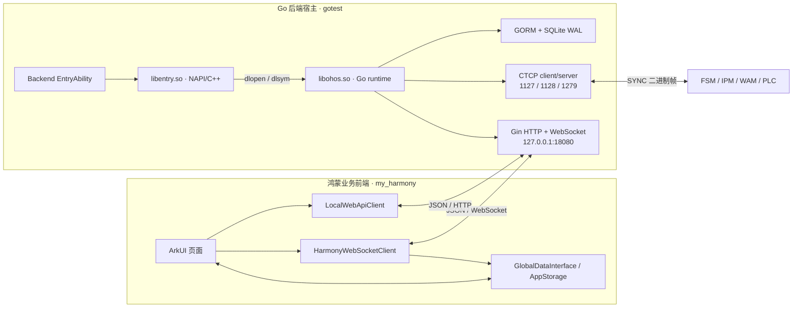
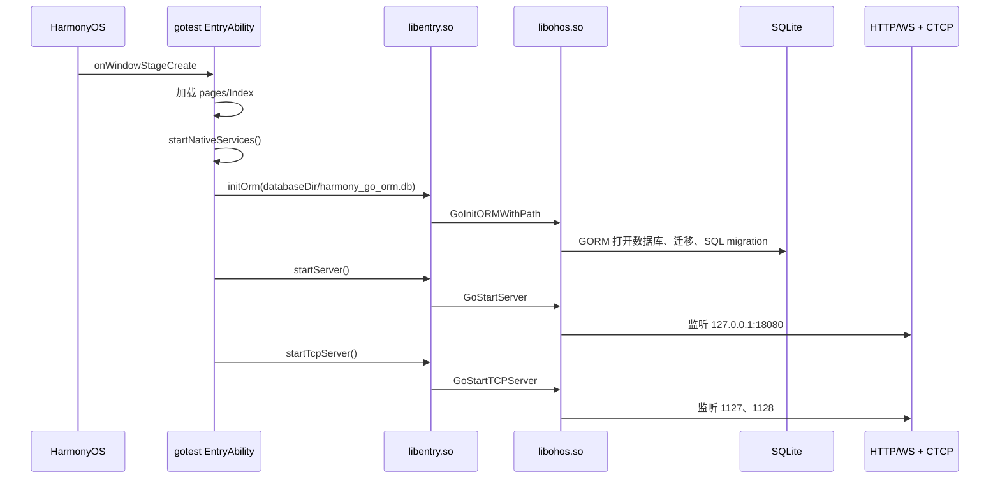
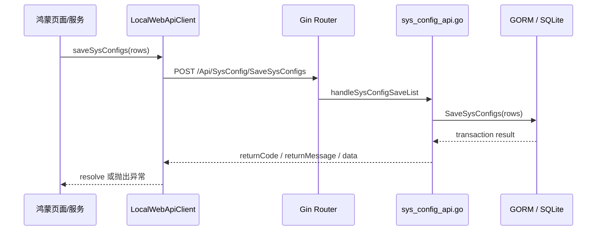
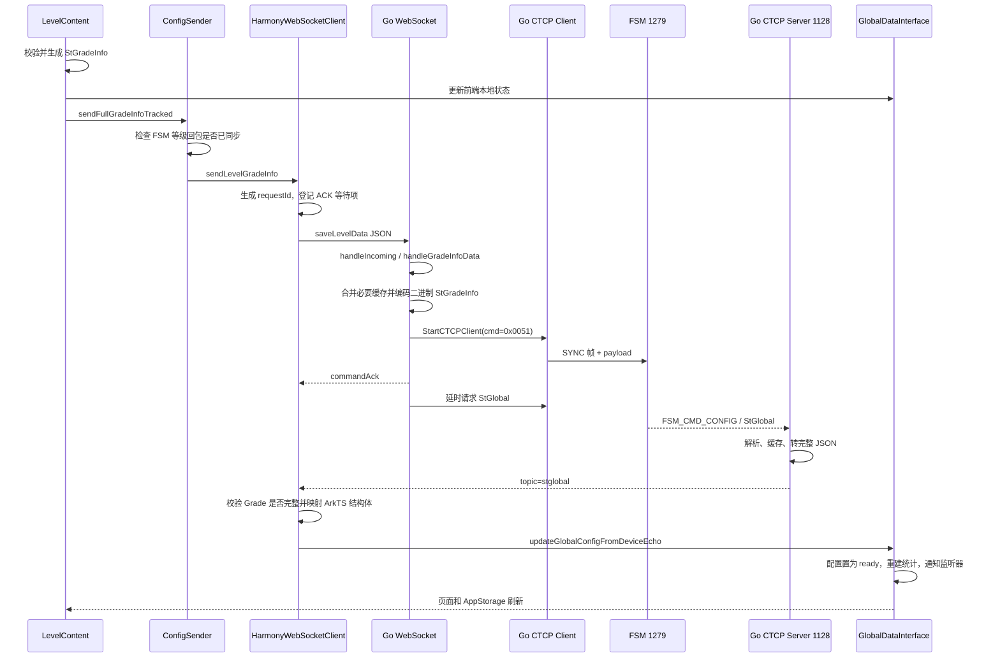

# 鸿蒙 ArkTS 与 Go 后端联调实践

> 从页面操作到设备回读：基于 `E:\new\my_harmony` 前端与 `E:\gotest` 后端当前代码整理
>
> 正式架构与联调手册：[docs/前后端联合架构与联调手册.md](docs/前后端联合架构与联调手册.md)

## 1. 这次培训讲什么

### 1.1 培训定位

这不是 ArkTS 或 Go 的入门语法课，而是一场面向项目成员的工程联调分享。

听众已经熟悉水果分选上位机业务，也有较丰富的开发经验，但不熟悉鸿蒙开发。因此培训重点放在下面五个问题：

1. 鸿蒙前端与 Go 后端为什么这样拆分？
2. 两边怎样通信，又怎样管理各自的生命周期？
3. 一次页面操作怎样经过 Go、TCP 和下位机，再回到页面？
4. 数据没有更新时，怎样判断问题处于页面、WebSocket、Go、TCP 还是设备端？
5. 当前方案有哪些优势、代价和适用边界？

### 1.2 建议标题

**《鸿蒙 ArkTS 与 Go 后端联调实践——从页面操作到设备回读》**

### 1.3 培训结束后希望听众得到什么

- 能说清当前前端、后端、NAPI 和下位机之间的边界。
- 能区分 HTTP、WebSocket、NAPI 和 TCP 各自负责什么。
- 能沿着一条真实链路定位“数据为什么没有更新”。
- 能理解为什么“发送成功”不等于“设备已经生效”。
- 能评价这套架构适合什么项目，以及需要承担哪些复杂度。

### 1.4 本次不展开的内容

- 不讲 ArkTS 和 Go 基础语法。
- 不逐个介绍全部页面或接口。
- 不展开 Qt、C# 的具体实现对比。
- 不逐字段讲解大型协议结构体。
- 不把培训变成一次完整代码评审。

---

## 2. 先讲清一个重要事实：当前是两个独立应用

根据当前代码，前端和 Go 后端宿主是两个独立的 HarmonyOS bundle：

| 角色 | 项目 | Bundle | 当前职责 |
|---|---|---|---|
| 鸿蒙业务前端 | `E:\new\my_harmony` | `com.nutpi.My_Project` | 页面、交互、前端状态、HTTP/WebSocket 客户端 |
| Go 后端宿主 | `E:\gotest` | `com.nutpi.gotest` | 加载 Go 动态库，启动 HTTP/WebSocket、TCP、ORM、OPC UA 和 Modbus 服务 |

当前前端代码不会主动启动 `gotest` 后端应用。它在 `EntryAbility.onCreate()` 中直接连接本机 `127.0.0.1:18080`，因此联调前必须先保证后端宿主已启动并且端口已经监听。

这也是第一条排错原则：

> 页面报网络错误时，先确认 Go 后端进程和端口，不要一开始就改页面代码。

### 2.1 当前端点

| 用途 | 地址 | 调用方 |
|---|---|---|
| HTTP API | `http://127.0.0.1:18080/` | `LocalWebApiClient` |
| WebSocket | `ws://127.0.0.1:18080/ws/data` | `HarmonyWebSocketClient` |
| 健康检查 | `http://127.0.0.1:18080/ping` | 联调人员 |
| Go 后端日志 | `http://127.0.0.1:18080/Api/Debug/GoLogs` | 联调人员 |
| 下位机主动上报 | HC 的 `1127/1128` 端口 | FSM/IPM/WAM |
| HC 主动下发 FSM | FSM 的 `1279` 端口 | Go CTCP client |

---

## 3. 总体架构



### 3.1 每层只做什么

| 层 | 主要职责 | 不应该承担的职责 |
|---|---|---|
| ArkUI 页面 | 收集输入、展示状态、触发业务动作 | 自己拼二进制协议、直接连接所有下位机 |
| 前端状态层 | 保存当前 FSM、配置快照、统计数据并通知 UI | 把本地乐观状态当成设备最终状态 |
| HTTP 客户端 | 查询和保存数据库类数据 | 承担高频实时推送 |
| WebSocket 客户端 | 实时数据、设备控制、命令结果与回读 | 每次操作重新建立短连接 |
| NAPI/C++ | 加载 Go 动态库、暴露少量生命周期入口 | 承担大批量业务 JSON 或实时数据转发 |
| Go 后端 | 协议转换、并发 I/O、业务编排、设备通信、持久化 | 直接控制 ArkUI 页面组件 |
| 下位机 | 执行配置和控制命令，提供真实运行数据 | 依赖前端本地缓存作为事实来源 |

### 3.2 最关键的设计点

NAPI 不是前后端每条业务数据的传输通道。当前设计中，它主要负责：

1. `dlopen("libohos.so")` 加载 Go 动态库。
2. 用 `dlsym` 找到 `GoStartServer`、`GoInitORMWithPath`、`GoStartTCPServer` 等 C ABI 符号。
3. 把少量启动、停止和诊断入口暴露给 ArkTS 后端宿主页面。

实际业务前端与 Go 后端之间使用 localhost HTTP/WebSocket。这样可以减少 NAPI 类型转换，把接口做成可抓取、可模拟、可独立测试的 JSON 协议。

---

## 4. 为什么采用鸿蒙前端 + Go 后端

### 4.1 鸿蒙前端负责设备端体验

- ArkUI 适合构建设备上的触控界面和响应式状态展示。
- Ability 生命周期能与鸿蒙窗口、前后台和资源管理结合。
- `AppStorage`、`@StorageLink` 和监听器适合把实时数据推到多个页面。
- 系统权限、文件、网络和打印能力可以直接使用 HarmonyOS Kit。

### 4.2 Go 后端负责持续运行的 I/O 与业务服务

- goroutine 适合同时处理 WebSocket、HTTP、多个 TCP 连接和周期任务。
- Gin 统一承载本机 HTTP 与 WebSocket 服务。
- Go 负责 JSON 与设备二进制结构体之间的转换，页面不需要理解 SYNC 帧。
- GORM 统一管理 SQLite 查询、事务、迁移和分表。
- 同一套 Go 业务逻辑更容易在 PC 测试工具、模拟器和鸿蒙设备之间复用。

### 4.3 为什么中间仍然需要 C++ NAPI

Go 不能直接作为 ArkTS 模块被调用。当前方案把 Go 编译为 `libohos.so`，再用 C++ NAPI 模块 `libentry.so` 作为 ArkTS 与 C ABI 的桥梁。

这层桥接保持得越薄越好。当前最合理的边界是：

- NAPI 管启动、停止和少量诊断。
- HTTP/WebSocket 管业务消息。
- TCP 管设备协议。

---

## 5. 两边怎样启动和管理生命周期

### 5.1 Go 后端宿主启动

后端宿主的关键代码位于：

- `E:\gotest\entry\src\main\ets\entryability\EntryAbility.ets`
- `E:\gotest\entry\src\main\cpp\napi_init.cpp`
- `E:\gotest\go\ohos\main.go`

启动顺序：



`startNativeServices()` 有幂等保护；`onDestroy()` 按 TCP、Modbus、OPC UA、HTTP/WebSocket 的顺序停止服务。

### 5.2 鸿蒙业务前端启动

前端关键代码位于：

- `E:\new\my_harmony\entry\src\main\ets\entryability\EntryAbility.ets`
- `E:\new\my_harmony\entry\src\main\ets\utils\network\HarmonyWebSocketClient.ets`
- `E:\new\my_harmony\entry\src\main\ets\protocol\UIDataSync.ets`

前端 `onCreate()` 做两件核心工作：

1. 启动 WebSocket 单例。
2. 启动 `UIDataSync`，把协议层变化同步到 `AppStorage`。

WebSocket 连接成功后，前端立即请求：

- FSM1 和 FSM2 的 `StGlobal`。
- 当前主页统计快照 `homeStats`。
- 当前协议统计快照 `statistics`。

连接关闭或报错时，前端每 3 秒尝试重连。`onDestroy()` 先发送 `close_client`，再关闭 WebSocket 和 UI 数据同步服务。

### 5.3 联调时的启动顺序

推荐顺序：

1. 启动 `gotest` 后端宿主。
2. 验证 `/ping` 返回 `pong from Go`。
3. 确认 Go 已监听 `1127/1128`，ORM 初始化成功。
4. 再启动 `my_harmony` 前端。
5. 确认前端日志出现 `[WS_DIAG] WebSocket 已连接`。
6. 确认 Go 收到 `requestStGlobal`，随后观察 FSM 配置回读。

---

## 6. HTTP 与 WebSocket 为什么同时存在

### 6.1 HTTP：请求—响应型数据

适合：

- 历史批次查询。
- 系统配置表 CRUD。
- 故障记录和基础故障信息。
- 设备注册、版本检查、打印模板等。

前端 `LocalWebApiClient` 默认访问 `http://127.0.0.1:18080/`，连接和读取超时均为 15 秒。后端业务接口返回统一 envelope；前端只有在 `returnCode === 1` 时才把请求视为成功。

以系统配置为例：



SQLite 文件库启用了 WAL 和 `synchronous=NORMAL`，目的是减少实时落库事务阻塞 HTTP 查询的概率。

### 6.2 WebSocket：实时推送与设备控制

适合：

- 前端发起设备命令。
- Go 主动推送 `stglobal`、`statistics`、`homeStats`、重量、波形和图像。
- 命令结果通过 `commandAck` 回到请求方。
- 连接持续存在，避免高频数据重复建连。

典型控制消息：

```json
{
  "type": "saveLevelData",
  "requestId": "saveLevelData-时间戳-序号",
  "fsmId": 256,
  "grade": "StGradeInfo 的 JSON 表示"
}
```

典型命令结果：

```json
{
  "type": "commandAck",
  "topic": "saveLevelData",
  "data": {
    "ok": true,
    "result": 0,
    "cmdId": 81,
    "destId": 256,
    "requestId": "saveLevelData-时间戳-序号"
  }
}
```

典型数据推送：

```json
{
  "type": "data",
  "topic": "stglobal",
  "data": "FSM 回读配置的 JSON 表示"
}
```

---

## 7. 主案例：等级配置怎样形成完整闭环

这个案例同时覆盖页面状态、WebSocket、Go JSON 解析、二进制编码、TCP 下发、设备回读和页面更新，最适合用作培训主演示。

### 7.1 完整链路



### 7.2 前端做了什么

`LevelContent` 保存时：

1. 把表格内容转换为等级数据。
2. 更新等级名称、标签和分类配置。
3. 必要时清空已经失效的出口映射。
4. 先更新本地 `GlobalDataInterface`，让页面快速反映操作。
5. 返回主页后，在后台调用 `sendFullGradeInfoTracked()`。

`ConfigSender` 在下发前还有一道安全门：如果 FSM 的等级配置回读还没有同步，就拦截整包下发，防止用前端默认结构覆盖设备真实配置。

### 7.3 Go 后端做了什么

Go WebSocket 收到 `saveLevelData` 后：

1. 按 `type` 分发到 `handleGradeInfoData()`。
2. 在 goroutine 中调用 `SendGradeInfoData()`，避免阻塞 WebSocket 读循环。
3. 校验 `grade` 是否存在。
4. 根据请求决定是否保留已缓存的出口位。
5. 把 JSON 结构编码为设备需要的 `StGradeInfo` 二进制 payload。
6. 根据 `fsmId` 解析目标 IP 和 `1279` 端口。
7. 通过 `StartCTCPClient()` 发送命令 `0x0051`。
8. 返回带原 `requestId` 的 `commandAck`。
9. 延时请求 FSM 回传新的 `StGlobal`。

### 7.4 回读为什么比发送结果更重要

Go 后端在 `1128` 收到 `FSM_CMD_CONFIG` 后，会解析完整 `StGlobal`，缓存后推送 `topic=stglobal`。

前端收到后还会做两层检查：

- `StGlobal.Grade` 不完整时直接丢弃，并限频重新请求。
- 配置完整时调用 `updateGlobalConfigFromDeviceEcho()`，把当前子系统标记为配置就绪和等级回读就绪。

因此设备回读才是这条配置链路的权威闭环。

---

## 8. 必须区分四种“成功”

| 成功层级 | 代表什么 | 不能证明什么 |
|---|---|---|
| 1. WebSocket `sendText()` 成功 | 消息已交给当前 WebSocket 连接 | Go 已正确解析、设备已收到 |
| 2. Go `commandAck.ok=true` | Go 已处理请求，当前 TCP 发送调用返回成功 | FSM 已应用配置、回读内容正确 |
| 3. 收到新的 `StGlobal` | FSM 已经回传配置快照 | 前端一定消费了正确 FSM 的完整数据 |
| 4. 前端状态和 UI 更新 | 当前页面已消费设备回读并完成渲染 | 之后不会被其他缓存或旧回读覆盖 |

### 8.1 当前等级与品质保存语义并不完全相同

- 等级保存 `saveLevelData` 默认不阻塞页面等待设备 ACK，ACK 主要用于异步记录；页面体验更快。
- 品质保存 `saveQualityData` 会等待命令结果，设备确认失败时不发布本地快照，也不离开编辑页。

培训时可以借此强调：

> “保存按钮完成”的产品语义，必须由业务明确；不能只看底层 API 返回了 `true`。

### 8.2 当前系统存在多级状态源

从临时到权威大致为：

1. 页面编辑草稿。
2. 前端本地状态和配置管理器。
3. Go 后端缓存。
4. FSM 实际配置与回读。

联调时要先问清“当前页面展示的是哪一级数据源”，否则很容易出现“页面看起来变了，但设备没有变”或“设备已经变了，页面仍显示旧值”。

---

## 9. 实时统计数据为什么有时不更新

实时统计的主要路径为：

```text
FSM → 1128 → Go 解析 StStatistics
    → 缓存并计算分选速度
    → 每秒推送 topic=statistics / homeStats
    → HarmonyWebSocketClient 映射 ArkTS 结构
    → GlobalDataInterface
    → UIDataSync / AppStorage / 页面
```

当前实现中，统计数据和配置数据存在门控关系：

- `statistics` 到达时，如果该子系统的 `StGlobal` 尚未就绪，前端会缓存统计数据并自动补发 `requestStGlobal`。
- `StGlobal` 到达并把配置标记为 ready 后，之前缓存的统计才能完整进入出口、等级和箱数等运行时汇总。
- 如果统计流超过约 2.5 秒没有新数据，Go 会把显示速度视为 stale 并推为 0。

所以“WebSocket 一直收到 statistics，但图表还是 0”不一定是图表问题，也可能是配置门控尚未打开。

---

## 10. 数据没有更新时的分层排错法

不要从页面一路猜到设备。每层只回答一个问题，确认后再进入下一层。

### 第 0 层：后端进程和端口是否存在

检查：

- `gotest` 后端宿主是否已经启动。
- `http://127.0.0.1:18080/ping` 是否返回 `pong from Go`。
- ORM、HTTP/WebSocket、1127 和 1128 是否启动成功。
- 18080 是否被其他进程占用。

如果这一层失败，前端所有 HTTP 和 WebSocket 现象都是后果。

### 第 1 层：前端是否连接到了正确地址

检查：

- 是否出现 `[WS_DIAG] WebSocket 已连接`。
- WebSocket 地址是否被 `AppStorage.WEBSOCKET_CLIENT_URL` 改写。
- HTTP 地址是否被 `AppStorage.WEB_SERVICE_URL` 改写。
- WebSocket 是否处于 3 秒重连窗口。
- HTTP 请求是否超时或返回 `returnCode != 1`。

注意：HTTP 和 WebSocket 的地址可以分别被覆盖，可能出现一边正常、另一边失败。

### 第 2 层：Go 是否收到并识别了请求

检查：

- `/Api/Debug/GoLogs` 是否出现对应 `WebSocket saveLevelData`、`saveSysConfig` 等日志。
- JSON 中的 `type`、`fsmId`、`requestId` 和业务 payload 是否存在。
- Go 是否记录 `empty StGradeInfo`、编码失败或缓存未就绪。
- 前端是否收到匹配原 `requestId` 的 `commandAck`。

如果前端发送成功但 Go 没有日志，优先检查连接地址、路由和消息格式。

### 第 3 层：Go 是否完成 TCP 下发

检查 Go 日志中的：

- `cmd` 是否正确，例如等级配置为 `0x0051`。
- `dest` 是否是当前 FSM，例如 FSM1 为 `0x0100`。
- 目标 IP 与端口是否正确，FSM 端口应为 `1279`。
- payload 长度是否符合结构体预期。
- `StartCTCPClient` 是否返回 0。

这一层成功只说明 TCP 发送调用成功，仍需继续看设备回读。

### 第 4 层：设备是否回读了权威状态

检查：

- 1128 是否收到 `FSM_CMD_CONFIG`。
- `dstId` 是否为 HC `0x1000`。
- `StGlobal` payload 是否能完整解析。
- 回读来自哪个 `srcId`，是否与当前 FSM 一致。
- Go 是否成功推送 `topic=stglobal`。

没有回读时，问题通常位于设备应用配置、网络回程、端口或协议结构体。

### 第 5 层：前端状态门控与页面是否消费成功

检查：

- 前端是否因为 `StGlobal.Grade` 不完整而丢弃帧。
- `isConfigReadyForSubsys()` 是否为 true。
- `isDeviceGradeEchoReady()` 是否为 true。
- 当前选择的是 FSM1 还是 FSM2。
- `GlobalDataInterface` 是否通知监听器。
- `UIDataSync`、`AppStorage` 或页面 `@Watch` 是否真的发生变化。
- 是否有本地乐观状态、旧缓存或较晚到达的旧回读覆盖了新值。

---

## 11. 常见现象与最快判断

| 现象 | 优先检查 | 关键证据 |
|---|---|---|
| HTTP 和 WebSocket 都失败 | Go 后端宿主、18080 | `/ping` 失败 |
| HTTP 正常、WebSocket 不通 | WS URL、`/ws/data`、连接状态 | 无 `[WS_DIAG] WebSocket 已连接` |
| 页面点击后立即显示新值，但设备没变化 | 本地乐观状态、TCP、设备回读 | 有本地更新，无新 `StGlobal` |
| 前端发送成功，Go 无对应日志 | 地址或消息格式 | `sendText=true`，GoLogs 无命令 |
| Go `commandAck.ok=true`，页面最后仍回到旧值 | 设备尚未应用或返回了旧快照 | 后续 `StGlobal` 仍是旧配置 |
| statistics 持续到达，出口/等级图仍为 0 | `StGlobal` 配置门控 | `configReady=false` |
| 只有某个 FSM 页面不更新 | `fsmId`、`srcId`、当前选择 | FSM1/FSM2 ID 不一致 |
| 统计速度突然为 0 | 统计流 stale | 超过约 2.5 秒无新统计 |
| 数据库查询偶发失败 | ORM 初始化、WAL、HTTP envelope | ORM 日志或 `returnCode != 1` |

---

## 12. 这套方案的优势与代价

| 设计选择 | 优势 | 代价 |
|---|---|---|
| ArkUI 与 Go 分工 | UI 和设备业务边界清楚 | 需要维护两套类型和构建链 |
| Go 编译为动态库 | 后端逻辑能在鸿蒙设备本地运行 | cgo、交叉编译和 ABI 兼容更复杂 |
| NAPI 只管生命周期 | 桥接层薄，业务数据不依赖复杂 NAPI 映射 | 仍需处理动态库加载和符号缺失 |
| localhost HTTP/WebSocket | 接口可调试、可模拟、可独立测试 | 两个应用存在启动顺序、端口和进程存活问题 |
| Go 统一设备协议 | 页面不必处理二进制和网络线程 | Go 成为关键中枢，日志和可观测性必须完善 |
| 设备回读作为权威状态 | 避免把本地成功误认为设备生效 | 需要处理延时、旧回读和状态门控 |
| GORM + SQLite WAL | 查询、事务、迁移统一 | 模型多、迁移和高频落库需要持续验证 |

### 12.1 适合的场景

- 设备端 UI 较复杂，同时存在大量 TCP、WebSocket 和数据库任务。
- 需要把设备协议和页面逻辑分开维护。
- 希望后端逻辑可以在 PC 工具和鸿蒙设备间复用。
- 需要本地运行，不依赖外部云服务。

### 12.2 不一定值得采用的场景

- 只有少量页面和简单 HTTP 调用，ArkTS 单体已经足够。
- 项目无法接受两个应用的启动和部署复杂度。
- 没有持续设备通信，也没有可复用的 Go 业务层。
- 团队没有能力维护 cgo、NAPI 和多平台构建链。

---

## 13. 40 分钟培训安排：可直接拆成 PPT

建议控制为 **35 分钟内容 + 5 分钟交流**。

| 页码 | 时间 | PPT 标题 | 这一页只讲什么 |
|---|---:|---|---|
| 1 | 2 分钟 | 为什么要聊前后端联调 | 五个核心问题，不讲语法 |
| 2 | 3 分钟 | 当前系统其实是两个应用 | 两个 bundle、启动顺序、localhost 端口 |
| 3 | 4 分钟 | 总体架构与职责边界 | ArkUI、HTTP/WS、NAPI、Go、TCP、SQLite |
| 4 | 3 分钟 | 生命周期：后端先起，前端再连 | 两侧 Ability 启停和 WebSocket 重连 |
| 5 | 3 分钟 | HTTP 与 WebSocket 怎么分工 | CRUD/查询与实时/控制的区别 |
| 6 | 8 分钟 | 等级配置完整闭环 | 页面→Go→TCP→FSM→StGlobal→页面 |
| 7 | 4 分钟 | 四种“成功”不是一回事 | send、commandAck、设备回读、UI 更新 |
| 8 | 5 分钟 | 数据不更新时怎么排查 | 从进程到 UI 的六层检查法 |
| 9 | 3 分钟 | 优势、代价与适用边界 | 不宣传语言优劣，只讲工程取舍 |
| 10 | 5 分钟 | 提问与讨论 | 收集大家对部署、状态源和联调的意见 |

### 13.1 每页建议讲法

#### 第 1 页：开场

可以直接说：

> 今天不教大家写 ArkTS 或 Go，而是沿着项目中的一条真实数据链路，看看页面、Go 和下位机怎样配合，以及数据不更新时应该从哪里查起。

#### 第 2 页：两个应用

重点强调当前代码事实：前端不会启动后端。如果 18080 没有监听，页面层不可能自行修复。

#### 第 3 页：架构图

只解释边界，不展开类名。让听众先记住：NAPI 管启动，HTTP/WS 管前后端，TCP 管设备。

#### 第 4 页：生命周期

强调后端初始化 ORM 后才开放服务；前端连上后再请求 `StGlobal`，避免前端尚未准备好就错过配置推送。

#### 第 5 页：协议分工

用一句话概括：

> HTTP 适合“我问你答”，WebSocket 适合“持续连接、双方都能主动发”。

#### 第 6 页：主案例

这是全场重点。不要展示完整 `StGradeInfo`，只展示消息类型、命令号、目标 FSM 和回读 topic。

#### 第 7 页：成功语义

最好现场问听众：“WebSocket send 返回 true，算保存成功吗？”然后给出四层答案。

#### 第 8 页：排错

用一张纵向表格展示：进程 → WS/HTTP → Go → TCP → 设备回读 → 前端状态。强调每层都必须留下证据。

#### 第 9 页：取舍

结论不是“Go 比其他后端好”，而是“这套拆分用更多部署和状态同步复杂度，换取 UI、业务服务和设备协议之间更清楚的边界”。

---

## 14. 建议现场演示

演示控制在 5～6 分钟，包含以下步骤：

1. 先访问 `/ping`，证明 Go 后端已启动。
2. 打开前端，展示 `[WS_DIAG] WebSocket 已连接`。
3. 在等级页面改一个明显值并保存。
4. 展示前端发出的 `saveLevelData` 和 `requestId`。
5. 打开 `/Api/Debug/GoLogs`，展示 Go 收到等级配置、编码后的 payload 长度、目标 IP/端口和发送结果。
6. 展示 Go 收到新的 `FSM_CMD_CONFIG`。
7. 展示前端收到 `stglobal`，页面最终显示设备回读值。

### 14.1 演示前准备

- 提前确认后端和下位机网络可达。
- 准备一个改动明显但安全的等级名称或阈值。
- 提前清理无关日志，确保关键链路容易找到。
- 准备一组成功日志截图，避免现场设备不在线导致培训中断。
- 如果没有真实 FSM，准备 mock 数据或录屏，但要明确说明哪部分是模拟的。

### 14.2 建议准备的 PPT 素材

- 总体架构图。
- 两侧启动时序图。
- 一条精简后的 `saveLevelData` JSON。
- 一条 Go TCP 下发日志。
- 一条 `FSM_CMD_CONFIG` 回读日志。
- 页面修改前后对比图。
- 六层排错表。
- 优势与代价对照表。

---

## 15. 关键代码索引

### 15.1 鸿蒙业务前端：`E:\new\my_harmony`

| 主题 | 文件 | 关键符号 |
|---|---|---|
| 前端生命周期 | `entry/src/main/ets/entryability/EntryAbility.ets` | `onCreate()`、`onDestroy()` |
| WebSocket 地址和重连 | `entry/src/main/ets/utils/network/HarmonyWebSocketClient.ets` | `DEFAULT_WS_URL`、`start()`、`connect()`、`scheduleReconnect()` |
| WebSocket 消息分发 | 同上 | `handleTextMessage()`、`handleCommandAck()` |
| 等级命令构造 | 同上 | `sendGradeInfoCommand()` |
| HTTP API 客户端 | `entry/src/main/ets/protocol/LocalWebApiClient.ets` | `DEFAULT_BASE_URL`、`post()`、`request()` |
| 配置发送门面 | `entry/src/main/ets/protocol/ConfigSender.ets` | `sendFullGradeInfoTracked()`、`sendSysConfigTracked()` |
| 等级页面入口 | `entry/src/main/ets/pages/level/LevelContent.ets` | `handleSaveData()` |
| 配置和统计状态 | `entry/src/main/ets/protocol/GlobalDataInterface.ets` | `updateStatistics()`、`updateGlobalConfigFromDeviceEcho()` |
| 状态同步到页面 | `entry/src/main/ets/protocol/UIDataSync.ets` | `start()`、`syncStatisticsToStorage()` |

### 15.2 Go 后端：`E:\gotest`

| 主题 | 文件 | 关键符号 |
|---|---|---|
| 后端宿主生命周期 | `entry/src/main/ets/entryability/EntryAbility.ets` | `startNativeServices()`、`stopNativeServices()` |
| NAPI 动态加载 | `entry/src/main/cpp/napi_init.cpp` | `LoadGoApi()`、`NapiStartServer()`、`NapiInitORM()` |
| Go C ABI 导出 | `go/ohos/main.go` | `GoStartServer`、`GoInitORMWithPath`、`GoStartTCPServer` |
| Gin 服务 | `go/ohos/Tcp/internal/runtime/server.go` | `newRouter()`、`startServer()` |
| WebSocket 路由与分发 | `go/ohos/Tcp/internal/runtime/websocket.go` | `registerWebSocketRoutes()`、`handleIncoming()` |
| 等级配置下发 | `go/ohos/Tcp/internal/runtime/websocket_grade_commands.go` | `SendGradeInfoData()` |
| 系统配置下发 | `go/ohos/Tcp/internal/runtime/websocket_fsm_commands.go` | `SendSysConfigData()` |
| TCP 收包和回推 | `go/ohos/Tcp/internal/runtime/ctcp_server.go` | `handleConnection()`、`handleCommandPayload()` |
| 统计缓存与推送 | `go/ohos/Tcp/internal/runtime/ctcp_statistics.go` | `cacheStStatisticsForSpeed()`、`publishLatestStStatisticsSpeed()` |
| ORM 初始化和路由 | `go/ohos/database/orm.go` | `InitORMWithPath()`、`RegisterRoutes()` |
| 系统配置 API | `go/ohos/database/sys_config_api.go` | `registerSysConfigRoutes()`、`SaveSysConfigs()` |

---

## 16. 最后总结

这套架构可以用四句话总结：

1. **鸿蒙前端负责交互和展示，Go 负责持续运行的业务、协议和数据服务。**
2. **NAPI 主要负责把 Go runtime 拉起来，业务通信走 localhost HTTP/WebSocket。**
3. **设备配置是否生效，要看设备回读，不能只看前端发送或 Go commandAck。**
4. **联调按进程、网络、Go、TCP、设备回读和前端状态逐层取证，避免跨层猜测。**

如果听众最后只记住一句话，可以是：

> 前后端联调不是确认“函数有没有调用”，而是证明数据跨过每一层后，最终权威状态仍然一致。
